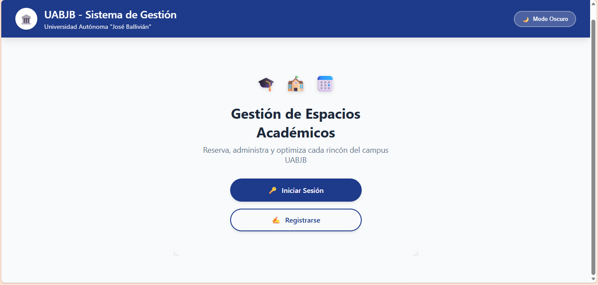
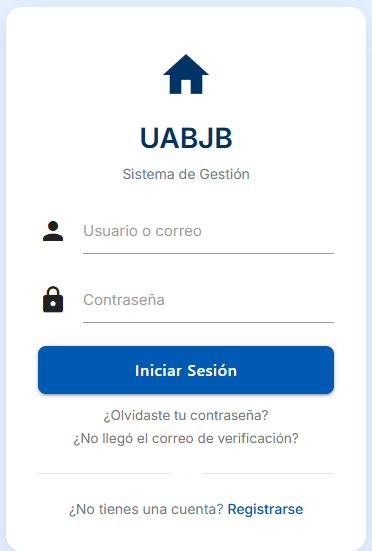
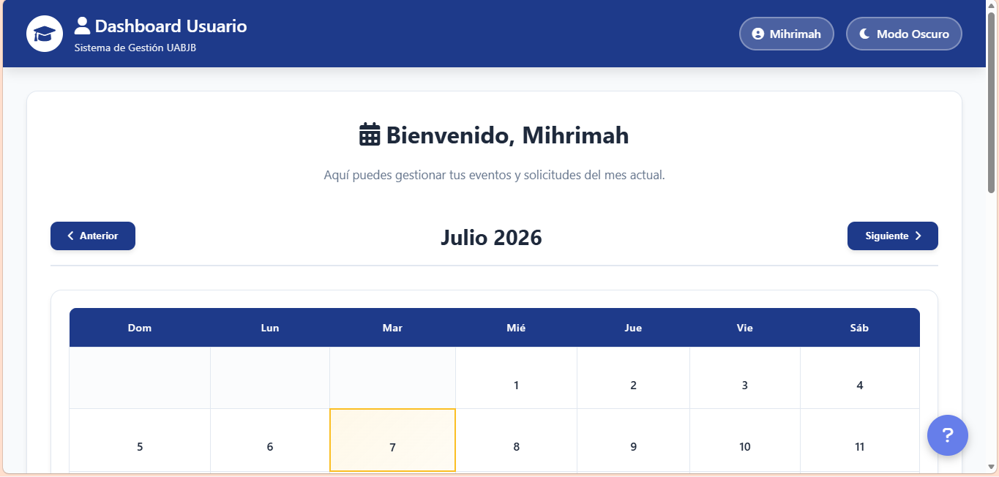
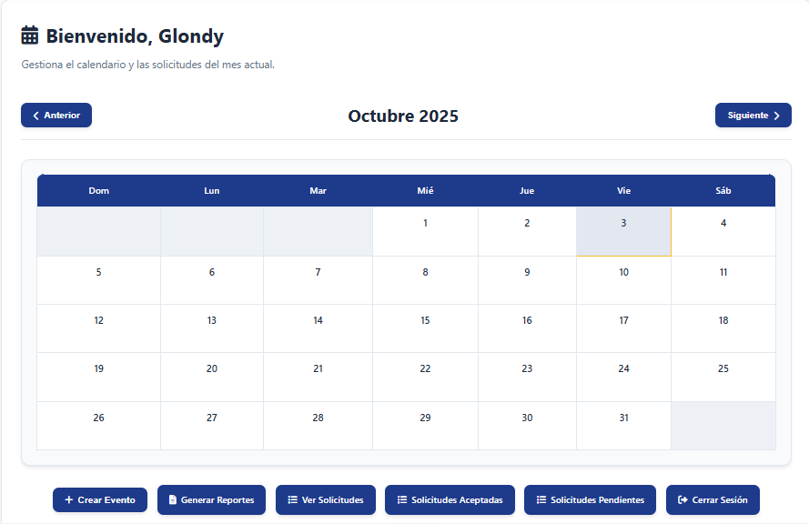
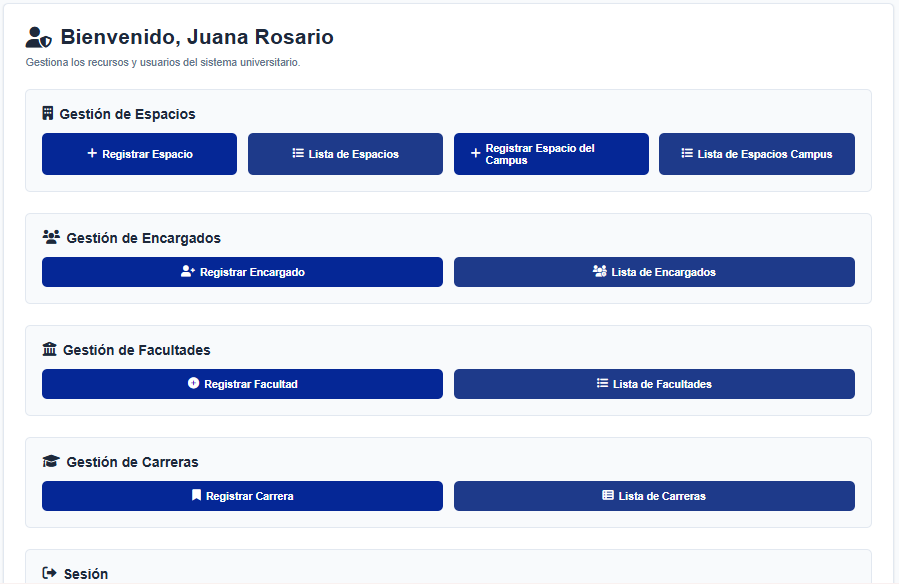

<p align="center">
  
</p>

<h1 align="center">
Sistema Web para la Gestión de Reservas de Espacios Académicos
</h1>

<p align="center">

[🇪🇸 Español](README.md) • [🇺🇸 English](README.en.md)

</p>

<p align="center">


</p>

---

## 📖 Descripción

Sistema web desarrollado como **Proyecto de Grado** para la obtención del título de Ingeniería de Sistemas en la Universidad Autónoma del Beni "José Ballivián" (UABJB).

La plataforma automatiza la gestión de reservas de espacios académicos mediante un flujo digital de solicitudes, aprobaciones y control de disponibilidad, reemplazando completamente el proceso manual utilizado por la institución.

---

## ✨ Características

- ✔ Autenticación basada en roles
- ✔ Gestión de usuarios
- ✔ Gestión de espacios académicos
- ✔ Solicitudes de reserva
- ✔ Validación automática de conflictos
- ✔ Calendario de disponibilidad
- ✔ Notificaciones automáticas por correo
- ✔ Reportes exportables
- ✔ Dashboard personalizado según el rol
- ✔ Arquitectura escalable basada en Django

---

## 🎯 Objetivo

Desarrollar una plataforma web escalable, transparente y mantenible que optimice la administración de espacios académicos mediante la automatización del proceso de reservas.

---

## 👥 Roles del Sistema

| Rol | Función |
|------|----------|
| Administrador | Configuración del sistema |
| Encargado | Aprueba o rechaza reservas |
| Usuario | Solicita reservas |

---

## 🏗 Arquitectura

```
Usuarios
     │
     ▼
 Django 4.2
     │
 PostgreSQL
     │
 Docker
```

---

## 🛠 Tecnologías

| Categoría | Tecnología |
|------------|------------|
| Lenguaje | Python 3.11 |
| Framework | Django 4.2 |
| Base de Datos | PostgreSQL 15 |
| Contenedores | Docker |
| Servidor | Gunicorn |
| Static Files | WhiteNoise |
| Reportes | ReportLab · OpenPyXL · python-docx |
| Frontend | HTML · CSS · JavaScript |

---

## 📦 Instalación

```bash
git clone https://github.com/carmenmirna-is/ProyectoGrado_GSA_UABJB.git

cd ProyectoGrado_GSA_UABJB

docker-compose up --build
```

Acceder a:

```
http://localhost:8000
```

---

## 📂 Estructura

```text
ProyectoGrado_GSA_UABJB/

administrador/

encargados/

usuarios/

reportes/

templates/

static/

media/

assets/

Dockerfile

docker-compose.yml

requirements.txt
```

---

## 📸 Capturas

### Página Principal



### Inicio de Sesión



### Dashboard Usuario



### Dashboard Encargado



### Dashboard Administrador



---

## 🚀 Mejoras Futuras

- API REST
- Diseño Responsive
- Integración con Google Calendar
- Recordatorios automáticos
- Sistema de códigos QR
- Pruebas unitarias
- CI/CD con GitHub Actions

---

## 🎓 Contexto Académico

Proyecto desarrollado como Trabajo de Grado para optar al título de Ingeniería de Sistemas en la Universidad Autónoma del Beni "José Ballivián".

---

## 📄 Licencia

Proyecto desarrollado con fines académicos.

Aunque fue desarrollado como proyecto universitario, sigue prácticas modernas de ingeniería de software, incluyendo arquitectura modular, control de acceso basado en roles, Docker, PostgreSQL y desarrollo web con Django.